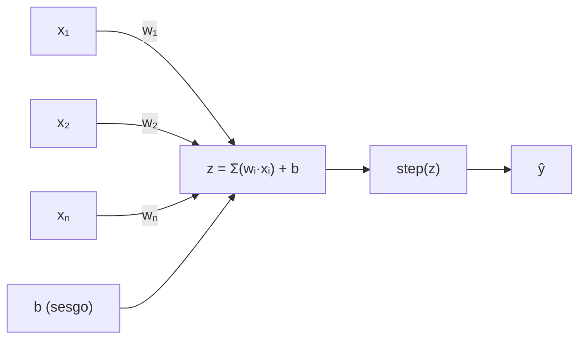

import { SITE } from "@/config";

*Basado en fuentes académicas: Rosenblatt (1958), Minsky & Papert (1969), y literatura contemporánea de arxiv.org*

Junio 2026

---

## 1. ¿Qué es un perceptrón?

El perceptrón es la forma más simple de red neuronal artificial. Es un **clasificador binario lineal**: toma un vector de entradas, las pondera mediante pesos, les suma un sesgo (*bias*) y produce una salida binaria (típicamente $0$ o $1$, o bien $-1$ o $+1$). Geométricamente, traza una línea —un hiperplano en dimensiones superiores— que separa dos clases de datos.

Constituye el **ladrillo fundamental del deep learning moderno**. Cada «neurona» en arquitecturas como *transformers*, *CNNs* o *GPTs* es, conceptualmente, un perceptrón con una función de activación diferenciable.

### 1.1 Origen histórico

El concepto de neurona artificial fue propuesto por **Warren McCulloch y Walter Pitts** en 1943 como un modelo matemático simplificado de la neurona biológica. Sin embargo, fue **Frank Rosenblatt** quien, en 1958, desarrolló el perceptrón como una máquina real —el *Mark I Perceptron*— y publicó el artículo fundacional del campo:

> *"The Perceptron: A Probabilistic Model for Information Storage and Organization in the Brain"*
> — Frank Rosenblatt, *Psychological Review*, 65(6), 386–408, 1958

Rosenblatt no solo describió la arquitectura, sino también un **algoritmo de aprendizaje** que permitía al perceptrón aprender de sus propios errores ajustando los pesos de las conexiones. Fue un hito: por primera vez, una máquina podía «aprender» de la experiencia sin ser programada explícitamente.

### 1.2 Arquitectura visual

El perceptrón opera en tres etapas claramente diferenciadas:

---

## 2. Formulación matemática

### 2.1 Suma ponderada

El corazón del perceptrón es una combinación lineal de las entradas. Cada entrada $x_i$ se multiplica por un peso $w_i$ que representa su importancia relativa, y se suma un término de sesgo $b$ (*bias*):

$$
z = w_1 x_1 + w_2 x_2 + \dots + w_n x_n + b = \sum_{i=1}^{n} w_i x_i + b
$$

Los **pesos** controlan cuánto influye cada entrada en la decisión final. El **sesgo** permite desplazar la frontera de decisión lejos del origen, lo cual es esencial cuando los datos no están centrados en cero.

### 2.2 Función de activación

La suma ponderada $z$ se pasa por una **función escalón** (*step function*), también conocida como función de Heaviside:

$$
\hat{y} = \begin{cases}
1 & \text{si } z \geq 0 \\
0 & \text{si } z < 0
\end{cases}
$$

Esta función introduce la **no linealidad mínima** necesaria para la clasificación binaria. Si $z$ cruza el umbral (cero), la neurona «dispara» (salida $1$); en caso contrario, permanece en reposo (salida $0$).

### 2.3 Regla de aprendizaje

El algoritmo de aprendizaje del perceptrón es sorprendentemente simple. Cuando la predicción $\hat{y}$ difiere de la etiqueta real $y$, se actualizan los pesos en la dirección que corrige el error:

$$
w_i \leftarrow w_i + \eta \cdot (y - \hat{y}) \cdot x_i
$$

$$
b \leftarrow b + \eta \cdot (y - \hat{y})
$$

Donde $\eta$ (*eta*, **tasa de aprendizaje**) controla la magnitud de los ajustes. Valores típicos: $0.01$, $0.1$ o $1.0$.

La regla tiene una interpretación intuitiva:

- Si la predicción fue $0$ pero debía ser $1$: aumentamos los pesos de las entradas positivas.
- Si fue $1$ pero debía ser $0$: reducimos los pesos de las entradas positivas.

### 2.4 Teorema de convergencia

El **teorema de convergencia del perceptrón**, demostrado por **Novikoff (1962)**, garantiza que:

> Si los datos de entrenamiento son **linealmente separables**, el algoritmo encontrará un hiperplano que los clasifique perfectamente en un **número finito de iteraciones**.

Este resultado fue fundamental para establecer las bases teóricas del aprendizaje automático.

---

## 3. Limitaciones y el invierno de la IA

### 3.1 El problema XOR

En 1969, **Marvin Minsky y Seymour Papert** publicaron el influyente libro *«Perceptrons»*, donde demostraron matemáticamente que un perceptrón de una sola capa **no puede resolver problemas no linealmente separables**. El ejemplo canónico es la función lógica XOR (OR exclusivo):

<table>
  <thead style="background-color: var(--muted);">
    <tr>
      <th style="padding: 8px; vertical-align: middle; text-align: center;">$X_1$</th>
      <th style="padding: 8px; vertical-align: middle; text-align: center;">$X_2$</th>
      <th style="padding: 8px; vertical-align: middle; text-align: center;">XOR</th>
    </tr>
  </thead>
  <tbody>
    <tr>
      <td style="text-align: center;">0</td>
      <td style="text-align: center;">0</td>
      <td style="text-align: center;">0</td>
    </tr>
    <tr>
      <td style="text-align: center;">0</td>
      <td style="text-align: center;">1</td>
      <td style="text-align: center;">1</td>
    </tr>
    <tr>
      <td style="text-align: center;">1</td>
      <td style="text-align: center;">0</td>
      <td style="text-align: center;">1</td>
    </tr>
    <tr>
      <td style="text-align: center;">1</td>
      <td style="text-align: center;">1</td>
      <td style="text-align: center;">0</td>
    </tr>
  </tbody>
</table>

No existe una sola línea recta en el plano que separe los puntos $(0,0)$ y $(1,1)$ —que deben dar $0$— de los puntos $(0,1)$ y $(1,0)$ —que deben dar $1$—. Se necesita al menos una frontera curva o, equivalentemente, **más de una capa**.

  

    <iframe
      src="/embeds/xor-perceptron.html"
      title="XOR y el limite del perceptron"
      loading="lazy"
      onload="const frame=this; const syncHeight=()=>{ try { frame.style.height = Math.ceil(frame.contentWindow.document.documentElement.scrollHeight) + 'px'; } catch {} }; syncHeight(); frame.contentWindow.addEventListener('resize', syncHeight);"
      style="display: block; width: 100%; min-height: 420px; border: 0;"
    ></iframe>
  

  

    Si no carga en esta vista, abrilo en
    <a href="/embeds/xor-perceptron.html" target="_blank" rel="noopener noreferrer">una pestaña nueva</a>.
  

### 3.2 Consecuencias históricas

La crítica de Minsky y Papert, combinada con las expectativas exageradas que el propio Rosenblatt había alimentado, provocó el **primer «invierno de la IA»**. La financiación para la investigación en redes neuronales se desplomó y el campo permaneció estancado durante más de una década. No fue hasta los años 80 —con el desarrollo del algoritmo de **retropropagación** (*backpropagation*) por Rumelhart, Hinton y Williams (1986)— que las redes neuronales resurgieron con fuerza.

> *Although the perceptron initially seemed promising, it was quickly proved that perceptrons could not be trained to recognise many classes of patterns.*
> — Wikipedia: Perceptron

---

## 4. Del perceptrón al deep learning

### 4.1 El perceptrón multicapa (MLP)

La solución al problema XOR y a las limitaciones del perceptrón simple fue **apilar múltiples capas** de neuronas, usando funciones de activación no lineales y diferenciables ($\sigma$, $\tanh$, $\text{ReLU}$) en lugar del escalón. Así nació el **perceptrón multicapa (MLP)**, capaz de aproximar cualquier función continua (**teorema de aproximación universal**, Cybenko 1989).

Como señala un artículo reciente de arxiv.org ([2409.13854](https://arxiv.org/abs/2409.13854), *«More Consideration for the Perceptron»*):

> El desarrollo de perceptrones multicapa y algoritmos de entrenamiento como la retropropagación permitió el procesamiento de problemas no lineales. Usar una sola neurona en una red de una capa para clasificación binaria es equivalente a un clasificador lineal simple.

### 4.2 Comparativa

<table>
  <thead style="background-color: var(--muted);">
    <tr>
      <th style="padding: 8px; vertical-align: middle;">Característica</th>
      <th style="padding: 8px; vertical-align: middle;">Perceptrón simple</th>
      <th style="padding: 8px; vertical-align: middle;">Perceptrón multicapa (MLP)</th>
    </tr>
  </thead>
  <tbody>
    <tr>
      <td><strong>Capas</strong></td>
      <td>1</td>
      <td>2 o más capas ocultas</td>
    </tr>
    <tr>
      <td><strong>Activación</strong></td>
      <td>Escalón (<em>step</em>)</td>
      <td>Sigmoide, ReLU, tanh</td>
    </tr>
    <tr>
      <td><strong>Frontera de decisión</strong></td>
      <td>Lineal</td>
      <td>No lineal</td>
    </tr>
    <tr>
      <td><strong>Resuelve XOR</strong></td>
      <td>❌ No</td>
      <td>✅ Sí</td>
    </tr>
    <tr>
      <td><strong>Algoritmo</strong></td>
      <td>Regla del perceptrón</td>
      <td>Backpropagation + gradiente descendente</td>
    </tr>
    <tr>
      <td><strong>Garantía de convergencia</strong></td>
      <td>✅ Para datos separables</td>
      <td>❌ No hay garantía de óptimo global</td>
    </tr>
  </tbody>
</table>

### 4.3 Relevancia actual

Hoy, el perceptrón es mucho más que una pieza de museo. Es la **unidad fundamental** sobre la que se construyen arquitecturas como:

- **Redes convolucionales (CNNs):** cada filtro es un perceptrón aplicado localmente.
- **Transformers:** el mecanismo de atención se combina con capas *feedforward* que son esencialmente MLPs.
- **Modelos de lenguaje (GPT, LLaMA, Claude):** cada bloque transformer contiene miles de «neuronas» que son, en esencia, perceptrones modernos.
- **Autoencoders y GANs:** construidos sobre capas densas de perceptrones.

> **Entender el perceptrón es entender el alfabeto del deep learning.** Toda la complejidad de los modelos actuales emerge de la combinación de estas unidades simples.

---

## 5. Referencias

1. **Rosenblatt, F. (1958)** — *The Perceptron: A Probabilistic Model for Information Storage and Organization in the Brain.* Psychological Review, 65(6), 386–408. <a href="https://doi.org/10.1037/h0042519" target="_blank" rel="noopener noreferrer">Ver recurso</a>

2. **Minsky, M. & Papert, S. (1969)** — *Perceptrons: An Introduction to Computational Geometry.* MIT Press. <a href="https://mitpress.mit.edu/9780262630221/perceptrons/" target="_blank" rel="noopener noreferrer">Ver recurso</a>

3. **Novikoff, A. B. (1962)** — *On convergence proofs for perceptrons.* Symposium on the Mathematical Theory of Automata, 12, 615–622. <a href="https://cs.uwaterloo.ca/~y328yu/classics/novikoff.pdf" target="_blank" rel="noopener noreferrer">Ver recurso</a>

4. **Rumelhart, D., Hinton, G. & Williams, R. (1986)** — *Learning representations by back-propagating errors.* Nature, 323, 533–536. <a href="https://doi.org/10.1038/323533a0" target="_blank" rel="noopener noreferrer">Ver recurso</a>

5. **Cybenko, G. (1989)** — *Approximation by superpositions of a sigmoidal function.* Mathematics of Control, Signals, and Systems, 2(4), 303–314. <a href="https://doi.org/10.1007/BF02551274" target="_blank" rel="noopener noreferrer">Ver recurso</a>

6. **arXiv:2409.13854 (2024)** — *More Consideration for the Perceptron.* <a href="https://arxiv.org/abs/2409.13854" target="_blank" rel="noopener noreferrer">Ver recurso</a>

7. **arXiv:2510.18862 (2025)** — Trabajo sobre perceptrones y clasificación binaria. <a href="https://arxiv.org/abs/2510.18862" target="_blank" rel="noopener noreferrer">Ver recurso</a>

8. **arXiv:2012.03642 (2020)** — *Generalised perceptron and feed-forward networks.* <a href="https://arxiv.org/abs/2012.03642" target="_blank" rel="noopener noreferrer">Ver recurso</a>

---

*Documento generado a partir del PDF original — Junio 2026*
