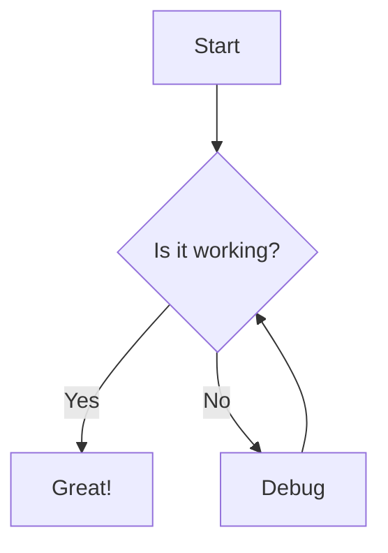
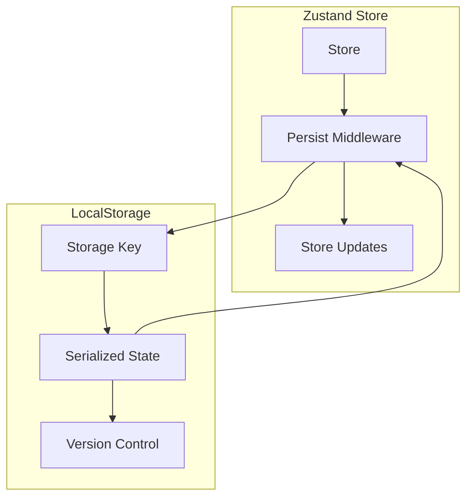
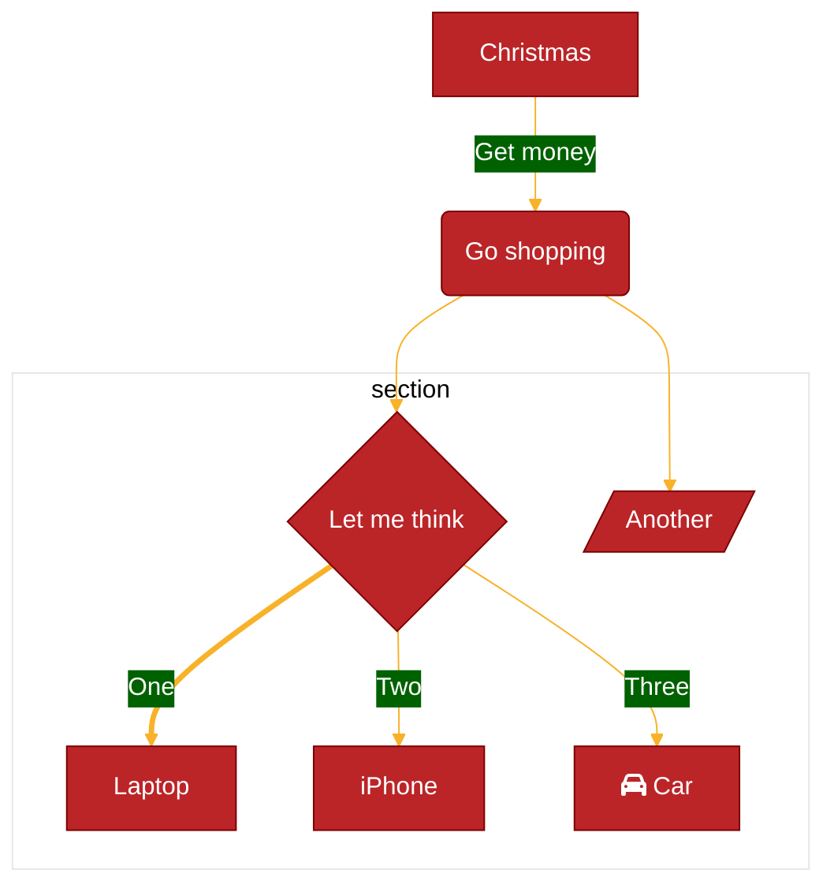
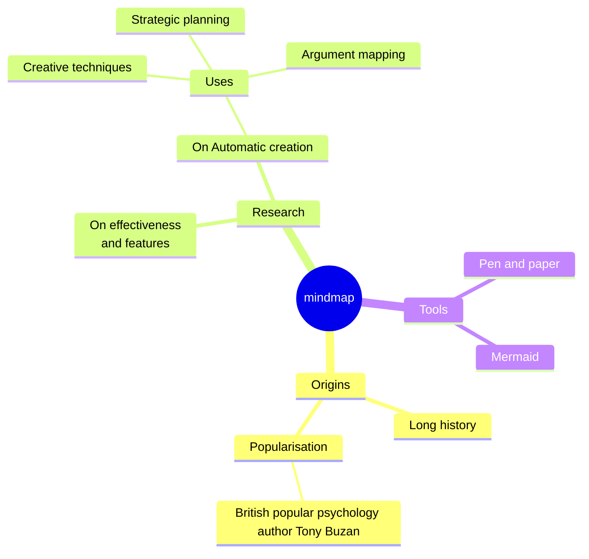
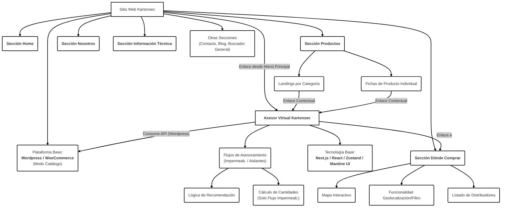

# Mermaid test

```mermaid
graph TD
    A[Start] --> B{Is it working?}
    B -->|Yes| C[Great!]
    B -->|No| D[Debug]
    D --> B
```

## Arquitectura de Persistencia

```mermaid
graph TD
    subgraph "Zustand Store"
        A[Store] --> B[Persist Middleware]
        B --> C[Store Updates]
    end
    
    subgraph "LocalStorage"
        D[Storage Key] --> E[Serialized State]
        E --> F[Version Control]
    end
    
    B --> D
    E --> B
```

## Styling

```mermaid
%%{
  init: {
    'theme': 'base',
    'themeVariables': {
      'primaryColor': '#BB2528',
      'primaryTextColor': '#fff',
      'primaryBorderColor': '#7C0000',
      'lineColor': '#F8B229',
      'secondaryColor': '#006100',
      'tertiaryColor': '#fff'
    }
  }
}%%
        graph TD
          A[Christmas] -->|Get money| B(Go shopping)
          B --> C{Let me think}
          B --> G[/Another/]
          C ==>|One| D[Laptop]
          C -->|Two| E[iPhone]
          C -->|Three| F[fa:fa-car Car]
          subgraph section
            C
            D
            E
            F
            G
          end
```

##  Mindmap

```mermaid
mindmap
  root((mindmap))
    Origins
      Long history
      Popularisation
        British popular psychology author Tony Buzan
    Research
      On effectiveness<br/>and features
      On Automatic creation
        Uses
            Creative techniques
            Strategic planning
            Argument mapping
    Tools
      Pen and paper
      Mermaid

```

### General blocks diagram

```mermaid
---
config:
  layout: fixed
  theme: neo
---
flowchart TD
    A["Sitio Web Kartonsec"] --> B("Plataforma Base:<br><b>Wordpress / WooCommerce</b><br>(Modo Catálogo)") & C("<b>Sección Home</b>") & D("<b>Sección Productos</b>") & E("<b>Sección Nosotros</b>") & F("<b>Sección Información Técnica</b>") & G("<b>Sección Dónde Comprar</b>") & H("Otras Secciones<br>(Contacto, Blog, Buscador General)")
    D --> D1("Landings por Categoría") & D2("Fichas de Producto Individual")
    G --> G1("Mapa Interactivo") & G2("Funcionalidad Geolocalización/Filtro") & G3("Listado de Distribuidores")
    J["<b>Asesor Virtual Kartonsec</b>"] --> K("Tecnología Base:<br><b>Next.js / React / Zustand / Mantine UI</b>") & L("Flujos de Asesoramiento<br>(Impermeab. / Aislantes)")
    L --> L1("Lógica de Recomendación") & L2("Cálculo de Cantidades<br>(Solo Flujo Impermeab.)")
    A -- Enlace desde Menú Principal --> J
    D1 -- Enlace Contextual --> J
    D2 -- Enlace Contextual --> J
    J -- Consume API (Wordpress) --> B
    J -- Enlace a --> G
```