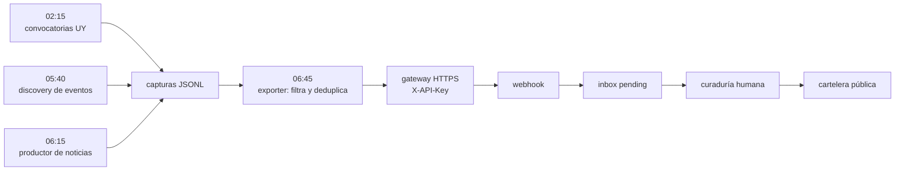

import { SITE } from "@/config";

<figure>
  

  <figcaption class="text-center">
    La cartelera de Pívot en producción, y los procesos que la alimentan mientras nadie mira
  </figcaption>
</figure>

Son las dos y cuarto y el teléfono no vibra. Eso, en esta casa, quiere decir que todo está saliendo bien.

A esa hora, del otro lado, arrancan los procesos que alimentan la cartelera de Pívot: convocatorias uruguayas primero, eventos después, noticias más tarde. Nadie los mira. Cuando me despierto ya hay una tanda de ítems esperando en el inbox.

La cartelera no se llena sola. Se llena mientras yo duermo. La diferencia entre esas dos frases es todo el trabajo: alguien tuvo que escribir las reglas, los filtros y los límites, y esa parte no la hace ningún modelo.

## Cinco robots a las dos y cuarto de la mañana

A las 02:15 arranca el primero de cinco procesos que corren solos. Convocatorias uruguayas: eso sale temprano. Después viene el discovery de eventos a las 05:40, el productor de noticias a las 06:15, y a las 06:45 el exporter empuja lo capturado.

Los tres canales escriben en el mismo lugar: archivos JSONL que se acumulan. El exporter los lee, filtra, deduplica y manda el resultado por HTTPS con una clave a un gateway público que hace de relay hacia el webhook. La máquina vive detrás de una VPN: no expone nada entrante y solo empuja hacia afuera. Es la forma más aburrida de conectar dos mundos, y justamente por eso funciona.

Dos reglas ordenan esto. El dedupe por `(source, external_id)`: si un proceso se reenvía, nada se duplica. Y nada se publica solo: todo cae al inbox como `pending` y una persona decide. Cada canal corta en 8 ítems por corrida: prefiero ocho cosas buenas que ochenta regulares.

Si querés ver el resultado, está en [pivot.lat/cartelera-eventos](https://pivot.lat/cartelera-eventos/).

## Las fuentes no quieren ser leídas

Arranqué con 75 fuentes de noticias y solo 10 tenían alguna forma de saber la fecha. Las otras devolvían titulares sin cuándo. Sin fecha verificable, la noticia se descarta: nunca se estima. Después del barrido quedaron 44 de 75.

Las vías más comunes son tres. El feed trae la fecha exacta. El sitemap de noticias la trae nota por nota. Y a veces la fecha está en los datos estructurados del artículo, que el extractor de contenido no ve, así que hay que pedir la página cruda con `curl`.

Hay cuatro trampas. Los sitemaps de WordPress vienen paginados y el archivo sin número trae los más viejos. Un sitemap de 2013 se disfraza de fresco porque la portada tiene fecha de hoy; la señal es la mediana de las 20 fechas más nuevas. Fechas futuras significan sitemap de agenda, no de noticias. Un certificado TLS incompleto se disfraza de bloqueo de bots.

La rotación la armó [Santiago Aramendía](https://www.linkedin.com/in/santiagoaramendia/) sobre un CSV de 112: quedaron 75 fuentes elegibles, 8 de Uruguay, 43 de prioridad A y 24 de prioridad B. Las prioridades A, B y C las definió él. Cada corrida toma seis en tres anillos, 2 de Uruguay, 3 de A y 1 de B. El anillo uruguayo se barre cada 4 corridas, así que ninguna fuente se repite hasta agotar su anillo.

El portal de compras del Estado uruguayo publica un RSS con 857 ítems en el feed general, 597 en una ventana semanal y 13 vigentes para un inciso. Eso permitiría cambiar scraping con modelo por parseo directo.

## El día que el radar devolvió el diario equivocado

Una mañana le pedí la página de un medio uruguayo a un extractor y me devolvió el contenido de otro. Le pedí el de ese otro y me devolvió el del primero. No era un problema de mi código de búsqueda.

El caché emparejaba los resultados con las URLs por posición, y el proveedor devuelve primero los aciertos y deja los errores al final. Encima, el proveedor actual rota el orden incluso cuando todo sale bien.

En un radar que atribuye cada noticia a su medio, atribuir mal es publicar contenido ajeno como propio. El arreglo fue corregir el emparejamiento, purgar 206 entradas cruzadas de las cachés, dejar un auditor re-ejecutable y verificar que el contenido corresponda al dominio antes de atribuir.

El segundo modo de falla enseñó más. El conversor de convocatorias corrió del 07/09 al 13/09 con estado `ok` sin escribir un solo archivo, porque le pedía leer archivos a un proceso que solo tenía herramientas web. Resultado: 1 oportunidad contra 21 noticias. La firma del canal roto es la asimetría, un canal con un archivo mientras sus hermanos acumulan uno por día.

La lección: `last_status: ok` mide que el proceso terminó su turno, no que produjo algo. La verificación se hace en el disco, no en el reporte. El fix fue determinista, 13 de 13 ítems aceptados y una segunda corrida que devuelve 0 novedades.

## Curar es el producto

Lo que hace que la cartelera sirva es el filtro, no el volumen de datos. El volumen se consigue; el criterio, no. Y el criterio no se compra. La orquestación es el producto.

Las reglas de caducidad son decisiones editoriales escritas como código. Un evento se vence a la medianoche del día siguiente. Una oportunidad queda +7 días. Una noticia, +3 días. Un evento vencido no le sirve a nadie, y una noticia de hace dos semanas tampoco. Por eso esas reglas viven en el código y no en un documento aparte que nadie lee.

La otra decisión es humana y la sostengo: la máquina propone, la persona decide. Todo pasa por el inbox como `pending`. Elegir qué ve alguien cuando abre la cartelera es una decisión de producto, no un detalle de implementación. Hoy sigue igual, y va a seguir igual: automatizar esa parte sería perder lo que hace distinta a la cartelera.

Esto es lo que Brainsource abastece para [Pívot](https://pivot.lat): los cinco procesos, las 75 fuentes, el inbox y la cartelera pública. La misma arquitectura se puede volver a armar para otra ciudad, otro rubro u otro país.

Saludos sin apuro.
Gustavo.
