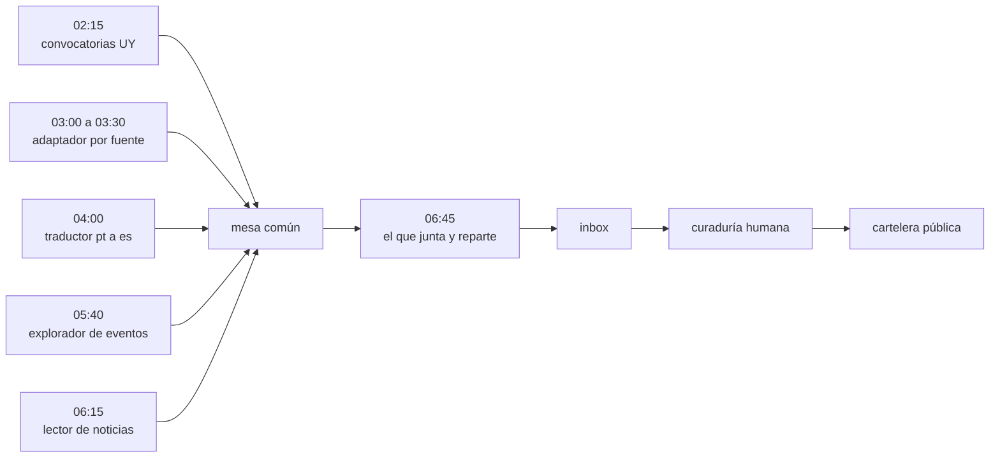

import { SITE } from "@/config";

<figure>
  

  <figcaption class="text-center">
    La cartelera de Pívot en producción, y los procesos que la alimentan mientras nadie mira
  </figcaption>
</figure>

Son las dos y cuarto y el teléfono no vibra. Eso, en esta casa, quiere decir que todo está saliendo bien.

A esa hora arranca la primera de diez tareas que alimentan la cartelera de [Pívot](https://pivot.lat), el muro de eventos, convocatorias y noticias para emprendedores de América Latina. Nadie las mira. Cuando me despierto ya hay una tanda de ítems esperando en el inbox.

La cartelera no se llena sola. Se llena mientras yo duermo. Y lo que tiene de interesante no es que haya procesos automáticos, sino que trabajan como una cuadrilla: cada uno con su tarea, su horario y su forma de entregar lo que hizo, y el resultado final lo firma una persona.

## Una cuadrilla no es un robot

La idea que tuve primero fue la obvia: un agente inteligente que hiciera todo. Se desarma sola. Un proceso que hace de todo sale carísimo, es imposible de auditar y, cuando falla, falla entero: no sabés qué parte se rompió porque no hay partes.

Lo que terminó funcionando es al revés. Diez tareas chicas entre las 02:15 y las 06:45, cada una con un trabajo acotado y una hora fija, y ninguna sabe que las otras existen. Cuatro momentos ordenan la madrugada: 02:15, 05:40, 06:15 y 06:45.

Lo que las une no es una conversación, es un contrato: qué deja cada una, dónde lo deja y con qué identidad. Se pasan cosas por una mesa común. Es una cocina: nadie discute el menú a las tres de la mañana, cada estación sabe qué tiene que salir y a qué hora.

Dos de esas diez son agentes: uno sale a buscar eventos y el otro lee noticias. Las otras ocho son scripts. El corte no es por moda, es por tipo de error. Un script hace siempre lo mismo y no se equivoca, pero no entiende nada. Un agente entiende, pero se equivoca. Así que el trabajo se corta donde equivocarse sale caro: una fecha, un cupo o una duplicación los resuelve un script; leer un titular y decidir si el evento es real, lo hace un agente.

Y al final de la fila hay una persona. No como red de seguridad: es el último puesto de la cuadrilla y el que pone el criterio.

Todo lo que esa cuadrilla junta se ve después acá: [la cartelera de Pívot](https://cartelera.pivot.lat).

## Lo difícil no es conseguir datos, es repartirlos

La cuadrilla trabaja sobre 75 fuentes de noticias que tienen 30 orígenes distintos, y el pipeline acepta material de 18 países: de Uruguay y Argentina a República Dominicana y Cuba. La lista la armó [Santiago Aramendía](https://www.linkedin.com/in/santiagoaramendia/) sobre un CSV de 112 fuentes, con una prioridad para cada una.

De ahí sale la primera regla dura: lo que no se puede fechar, no entra. Una noticia sin fecha verificable se descarta, no se estima. Suena obvio hasta que toca sostenerlo cien veces por día con fuentes que no quieren decir cuándo publicaron.

El problema de fondo, igual, no es conseguir datos: es repartirlos. Si cada corrida leyera las mismas fuentes, la cartelera tendría siempre los mismos tres medios. Por eso las fuentes rotan en anillos, seis por corrida, y ninguna se repite hasta agotar su anillo. También hay un tope de ocho por corrida, porque prefiero ocho cosas buenas que ochenta regulares.

Y hubo un día en que el reparto se rompió de una forma que no se arregla con código. Las convocatorias chilenas empezaron a inundar una cartelera uruguaya: había fuentes, había volumen, y el resultado era otro país. La respuesta no fue técnica, fue editorial. Pusimos cupos: quince convocatorias por día como máximo, 4 de Uruguay, 6 de LATAM y 5 del sector privado, y dentro de cada carril entra primero lo que cierra antes.

Lo mismo con el idioma. El material brasileño entra recién traducido: un traductor automático pasa a español solo lo que se ve en la tarjeta, el título y la descripción, sin tocar nombres, marcas ni cifras. Si no puede traducirlo, el ítem se descarta. En la cartelera no hay portugués crudo.

Sostener una decisión editorial todos los días es un problema de ingeniería. Tomarla es un problema de criterio, y el criterio no se programa.

## La cuadrilla miente cuando dice que salió bien

Una mañana le pedí la página de un medio uruguayo a un extractor y me devolvió el contenido de otro. Le pedí el de ese otro y me devolvió el del primero: el sistema emparejaba cada página con su respuesta por posición, y el proveedor devuelve primero los aciertos. En un radar que atribuye cada noticia a su medio, atribuir mal es publicar lo ajeno como propio. Purgué 206 entradas cruzadas y agregué la regla de verificar el dominio antes de atribuir.

El segundo caso enseñó más, porque no hubo error de nadie. El conversor de convocatorias corrió del 07/09 al 13/09 informando éxito y sin escribir un solo archivo. Nadie sospecha de un proceso en verde. La firma estaba en la asimetría: un canal con un archivo mientras sus hermanos acumulaban uno por día. La cartelera mostraba 1 oportunidad contra 21 noticias, y ese número fue la alarma.

De los dos quedó la misma lección, y es la parte de orquestar que menos se cuenta: a la cuadrilla no se la audita por lo que declara, se la audita por lo que dejó hecho. El estado `ok` mide que el proceso terminó su turno, no que haya producido algo. El inspector tiene que estar en el diseño, no en la confianza.

## El escritorio del que decide

Todo lo que produce la cuadrilla cae en un mismo lugar: el Inbox del admin de la cartelera. Nada llega publicado.

Ahí hay cuatro solapas y una lógica simple: En cartelera, Vencidos, Inbox y Papelera. Cada ítem entra como pendiente y se puede editar, fijar, arrastrar para ordenar, destacar en portada, publicar, descartar, restaurar o eliminar. Es un escritorio de trabajo, no un tablero de métricas.

La parte que más pensamos es la caducidad, porque es una decisión de producto disfrazada de detalle. Un evento se vence a la medianoche del día siguiente, una convocatoria vencida aguanta +7 días y una noticia vive +3 días en el muro. Y nada se borra: lo vencido se muda a su solapa y sigue ahí. El vencimiento es de vidriera, no de archivo.

El que cura no soy yo: es Santiago, que mira la cartelera todos los días. Ese detalle es de los más importantes del proyecto. De su curaduría salió el mejor diagnóstico que tuvo el sistema, el del canal que producía una convocatoria por cada veintiuna noticias, que se convirtió en cuatro fuentes nuevas, el carril LATAM y los cupos. La curaduría no es control de calidad: es el sensor de la máquina. El que cura es el único que sabe qué falta.

Queda abierta, y es linda, una discusión que no es técnica: ¿"Todo" es un feed, con lo último arriba, o una agenda, con lo que viene ordenado por fecha? No es un detalle de diseño. Define qué cartelera estamos haciendo.

## Lo que aprendí

Orquestar no es conectar modelos: es hacer convivir procesos que no se conocen. Contratos de entrega, una mesa común, un inspector que mira la obra en lugar del reporte, y alguien que decide al final. Dos agentes, ocho scripts y una persona.

Lo difícil nunca fue el modelo. Fue la convivencia.

Esto es lo que Brainsource abastece para [Pívot](https://pivot.lat): los procesos, las fuentes, el inbox y la cartelera pública. La misma arquitectura se puede volver a armar para otra ciudad, otro rubro u otro país.

Saludos sin apuro.
Gustavo.
