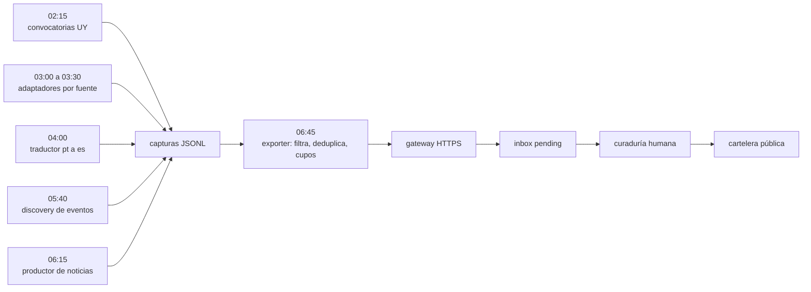

import { SITE } from "@/config";

<figure>
  

  <figcaption class="text-center">
    La cartelera de Pívot en producción, y los procesos que la alimentan mientras nadie mira
  </figcaption>
</figure>

Son las dos y cuarto y el teléfono no vibra. Eso, en esta casa, quiere decir que todo está saliendo bien.

A esa hora, del otro lado, arranca la primera de diez tareas que alimentan la cartelera de Pívot. Convocatorias uruguayas primero, las fuentes de madrugada después, eventos y noticias antes del amanecer. Nadie las mira. Cuando me despierto ya hay una tanda de ítems esperando en el inbox.

La cartelera no se llena sola. Se llena mientras yo duermo. La diferencia entre esas dos frases es todo el trabajo: alguien tuvo que escribir las reglas, los filtros y los límites, y esa parte no la hace ningún modelo.

## Lo que corre mientras Uruguay duerme

Diez procesos entre las 02:15 y las 06:45, y cuatro momentos que ordenan la madrugada: 02:15, 05:40, 06:15 y 06:45. Alrededor de ellos corren los demás: los adaptadores que leen la convocatoria de una fuente puntual, el traductor, el que empuja todo al final, el que manda el correo del día.

Dos de esos diez son agentes: uno sale a buscar eventos públicos y otro lee noticias. Los otros ocho son scripts. La diferencia importa. Un script hace siempre lo mismo y no se equivoca; un agente lee, duda y decide. Donde hay que ser exacto manda el script; donde hay que entender, el agente.

Los tres canales escriben en el mismo lugar: archivos JSONL que se acumulan. El exporter los lee, filtra, deduplica y manda el resultado por HTTPS con una clave a un gateway que hace de relay hacia el webhook. La máquina vive detrás de una VPN: no expone nada entrante y solo empuja hacia afuera. Es la forma más aburrida de conectar dos mundos, y justamente por eso funciona.

Dos reglas ordenan esto. El dedupe por `(source, external_id)`: si un proceso se reenvía, nada se duplica. Y nada se publica solo: todo cae al inbox como `pending` y una persona decide. El productor de noticias corta en 8 por corrida: prefiero ocho cosas buenas que ochenta regulares.

Si querés ver el resultado, está en [pivot.lat/cartelera-eventos](https://pivot.lat/cartelera-eventos/).

## De dónde viene el material

Para que una cartelera sirva hay que llenarla, y llenarla es más difícil de lo que parece.

Arranqué con 75 fuentes de noticias y solo 10 tenían alguna forma de saber la fecha. Las otras devolvían titulares sin cuándo. Sin fecha verificable, la noticia se descarta: nunca se estima. Después del barrido quedaron 44 de 75. Las trampas se repiten: el sitemap de un medio que quedó en 2013 mientras la portada muestra la fecha de hoy, la agenda de eventos disfrazada de noticias, el certificado roto que se parece a un bloqueo de bots.

Esas 75 fuentes tienen 30 orígenes distintos, y el pipeline acepta material de 18 países: de Uruguay y Argentina a República Dominicana y Cuba. La lista la armó [Santiago Aramendía](https://www.linkedin.com/in/santiagoaramendia/) sobre un CSV de 112 fuentes, con una prioridad para cada una: arriba las que tienen actividad clara y estructura estable, abajo las más locales o las que viven detrás de un paywall.

Y no alcanza con tenerlas. Si cada corrida leyera las mismas, la cartelera tendría siempre los mismos tres medios. Así que las fuentes rotan en anillos: cada corrida toma seis, 2 de Uruguay, 3 de prioridad alta y 1 de apoyo, en círculos que no repiten una fuente hasta agotar su anillo. El anillo uruguayo se barre cada 4 corridas, el grande cada 15, el de apoyo cada 24.

Después está el reparto, que es la decisión más editorial de todo el sistema. Un día me encontré con que las convocatorias chilenas inundaban una cartelera uruguaya: había fuentes, había volumen, y el resultado era otro país. El arreglo fueron los cupos. Quince convocatorias por día como máximo, 4 de Uruguay, 6 de LATAM y 5 del sector privado, y dentro de cada carril entra primero lo que cierra antes. El cupo se guarda por día, así que una segunda corrida no lo desborda.

Y hay algo que no se negocia: el material brasileño entra recién traducido. Si una captura llega en portugués, un traductor automático la pasa a español antes de que pueda existir en la cartelera. Traduce solo lo que se ve en la tarjeta, el título y la descripción, 600 caracteres como máximo, y no toca nombres, marcas ni cifras. Si la traducción no sale, el ítem se descarta. En la cartelera no hay portugués crudo.

## El día que el radar devolvió el diario equivocado

Una mañana le pedí la página de un medio uruguayo a un extractor y me devolvió el contenido de otro. Le pedí el de ese otro y me devolvió el del primero. El caché emparejaba cada página con su respuesta por posición, y el proveedor devuelve primero los aciertos y deja los errores al final. En un radar que atribuye cada noticia a su medio, atribuir mal es publicar contenido ajeno como propio. El arreglo fueron 206 entradas cruzadas purgadas y una regla nueva: verificar que el contenido corresponda al dominio antes de atribuir.

El segundo caso enseñó más, porque no hubo error de nadie. El conversor de convocatorias corrió del 07/09 al 13/09 con estado `ok` sin escribir un solo archivo, porque le pedía leer archivos a un proceso que solo tenía herramientas web. Resultado: 1 oportunidad contra 21 noticias. Cuando un proceso termina bien y no produce nada, no suena ninguna alarma. La firma es la asimetría: un canal con un archivo mientras sus hermanos acumulan uno por día. La verificación se hace en el disco, no en el reporte. `last_status: ok` mide que el proceso terminó su turno, no que haya hecho algo. El reemplazo fue determinista: 13 de 13 ítems aceptados, y una segunda corrida que devuelve 0 novedades.

## Curar es el producto

Lo que hace que la cartelera sirva es el filtro, no el volumen. El volumen se consigue; el criterio no.

Las reglas de caducidad son decisiones editoriales escritas como código. Un evento se vence a la medianoche del día siguiente. Una convocatoria queda +7 días. Una noticia, +3 días. Un evento vencido no le sirve a nadie, y una noticia de hace dos semanas tampoco. Por eso esas reglas viven en el código y no en un documento aparte que nadie lee.

La otra decisión la sostengo: la máquina propone, la persona decide. Todo pasa por el inbox como `pending`. Elegir qué ve alguien cuando abre la cartelera es una decisión de producto, no un detalle de implementación.

Y por eso me interesa esta clase de arquitecturas más que cualquier modelo suelto. Lo que hace funcionar a la cartelera no es la IA: es cómo está repartido el trabajo entre lo que siempre hace lo mismo, lo que decide y alguien que mira al final. Dos agentes, ocho scripts y una persona. Con un solo modelo pretendiendo hacer de todo, esto no aguanta una semana.

Esto es lo que Brainsource abastece para [Pívot](https://pivot.lat): los procesos, las fuentes, el inbox y la cartelera pública. La misma arquitectura se puede volver a armar para otra ciudad, otro rubro u otro país.

Saludos sin apuro.
Gustavo.
